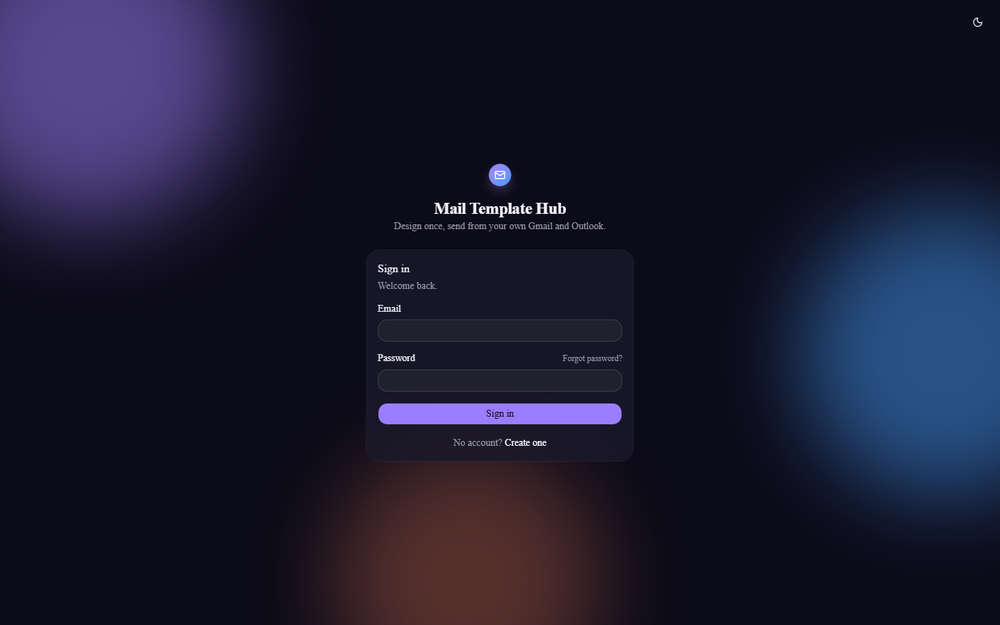
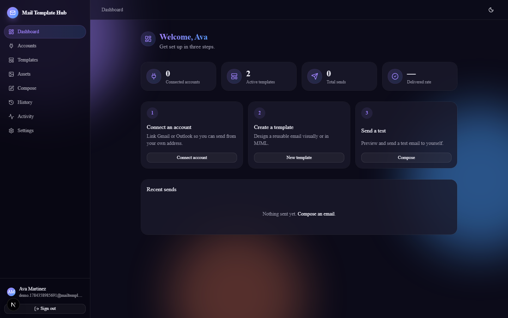
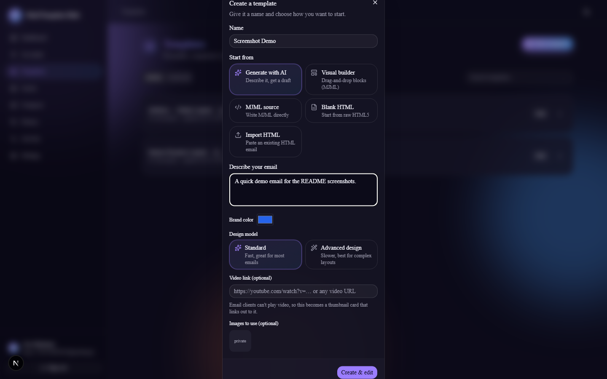
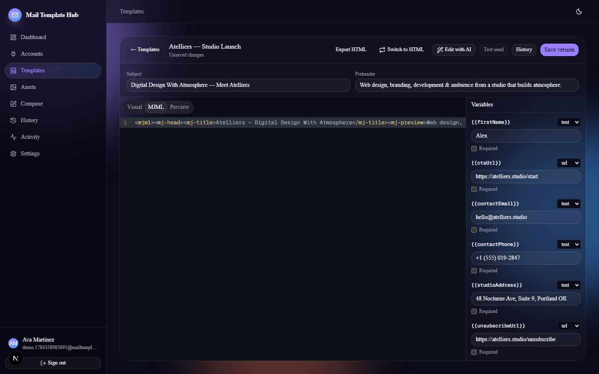
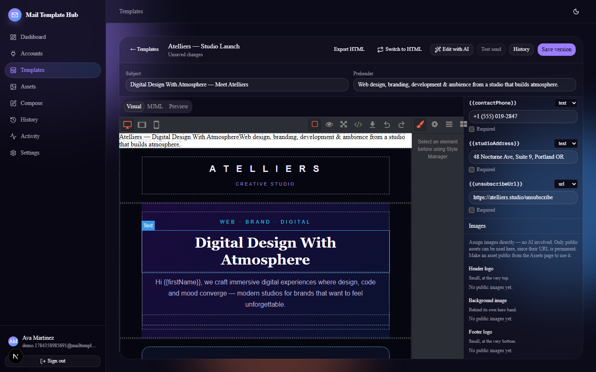
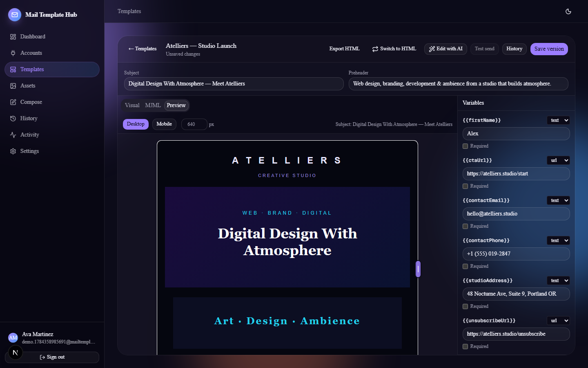
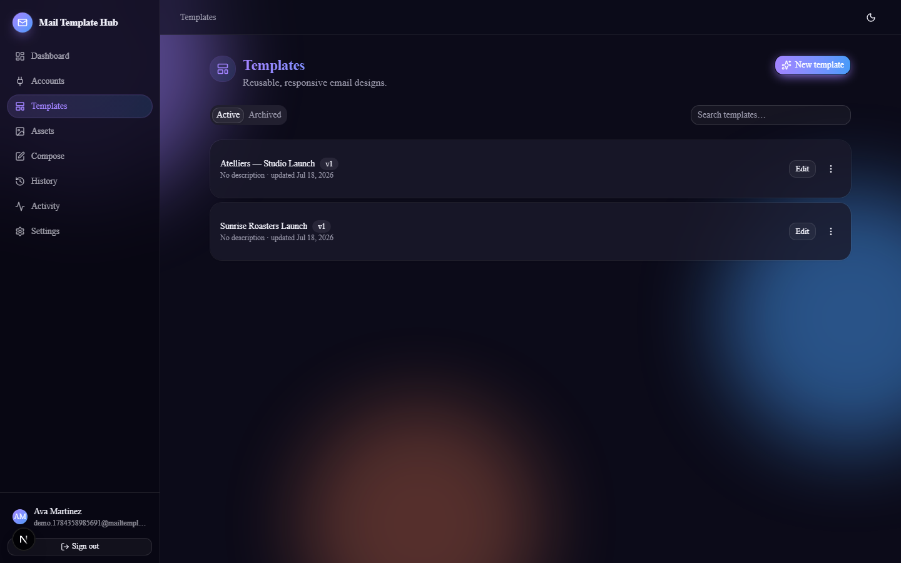
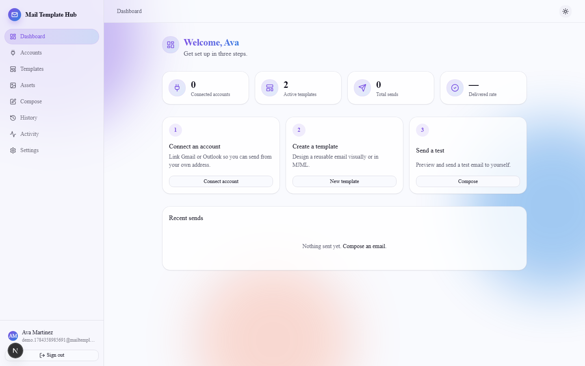

# Mail Template Hub

Connect Gmail and Outlook via OAuth, design responsive email templates — visually, in MJML or raw
HTML, hand-edited or generated/revised from a prompt by Claude — manage a shared asset library, and
send or schedule tracked email straight from the providers' own APIs.

**Spec-driven:** the full technical specification lives in [docs/spec/](docs/spec/README.md).
The build follows [docs/spec/12-implementation-plan.md](docs/spec/12-implementation-plan.md).

## Screenshots

|                                                                     |                                                                     |
| :-----------------------------------------------------------------: | :-----------------------------------------------------------------: |
|                         |                   |
| Sign in — glass panels over a soft gradient backdrop                | Dashboard — connected accounts, templates and delivery at a glance  |
|  |  |
| Generate a template from a prompt, choosing a Standard or Advanced design model | Visual (GrapesJS) / MJML source / live preview, with dark syntax highlighting |
|  |  |
| Manual background/header-logo/footer-logo placeholders — no AI required | Live preview with Desktop/Mobile presets, an exact-px input, and a drag handle |
|                   |                 |
| Templates list with versioning, duplicate, archive                  | Full light-mode theme, not just an inverted dark mode               |

## Features

- **Own-inbox sending** — OAuth-connect Gmail and/or Outlook (send-only scopes; we never see your
  password) and send through the provider's own API, so mail comes from your real address.
- **Three ways to build a template** — a drag-and-drop visual builder (GrapesJS) on top of MJML,
  raw MJML/HTML source with a live sandboxed preview, or **generate one from a natural-language
  prompt** with Claude, picking a **Standard** (fast) or **Advanced design** (higher-effort,
  Claude Opus) model per generation. AI generation streams the response and automatically
  continues across dropped connections or token-limit cutoffs, so long, detailed designs still
  come back complete.
- **Edit any template with AI** — for MJML, visual, or raw-HTML templates alike, describe a change
  ("make the CTA orange, add a coupon section") and the model revises the existing template in
  place instead of starting over.
- **Manual image placeholders** — assign a background image, header logo, and footer logo directly
  from your asset library, no AI involved; the corresponding MJML block is inserted/updated/removed
  for you.
- **Convert a template's format** — switch an existing template between MJML (visual builder +
  source view) and raw HTML at any time; MJML compiles down to static HTML, and HTML wraps
  losslessly into MJML (`mj-raw`) to go the other way.
- **Resizable live preview** — Desktop/Mobile presets, an exact-pixel width field, and a drag handle
  for anything in between.
- **Asset library** — presigned direct-to-storage uploads (MinIO/S3) with image/GIF/document
  support, dedupe, and per-user quota.
- **Scheduled & tracked sending** — queue, schedule, or test-send to yourself; per-recipient
  status with retries, backed by Hangfire.
- **Activity log** — an auditable record of security-relevant events per account.
- **Automation-friendly** — a scoped API-key auth scheme for scripting sends (see
  [docs/integrations/n8n-whatsapp.md](docs/integrations/n8n-whatsapp.md) for the n8n/WhatsApp
  approve-and-send workflow).
- **Light & dark mode**, both fully themed (not an inverted palette bolt-on).

## Stack

ASP.NET Core (.NET 10) · EF Core + PostgreSQL · Hangfire · MimeKit · Mjml.Net ·
MinIO/S3 · Anthropic Claude (AI template generation) · Next.js App Router (TypeScript) ·
Tailwind + shadcn/ui · TanStack Query · GrapesJS · CodeMirror

## Quickstart (local dev)

Prereqs: .NET 10 SDK, Node 20+, Docker.

```bash
# 1. Infrastructure: PostgreSQL 16, MinIO (S3), WireMock provider doubles
docker compose up -d

# 2. Backend API → http://localhost:5001  (health: /healthz)
dotnet run --project MailTemplateHub.Api

# 3. Frontend → http://localhost:3000 (proxies /api/* to the backend)
cd frontend && npm install && npm run dev
```

MinIO console: http://localhost:9001 (minioadmin / minioadmin).
Buckets `mth-private`, `mth-public` (anonymous download), `mth-snapshots` are created automatically.

AI template generation needs an Anthropic API key: set `Ai:ApiKey` (or `Ai__ApiKey`) via user
secrets/environment. Without a key, template generation falls back to a deterministic scaffold
so the rest of the app still works. `Ai:Model` / `Ai:AdvancedModel` control which model each
design tier uses (defaults: `claude-sonnet-5` / `claude-opus-4-8`).

Real Gmail/Outlook sending needs OAuth apps registered with each provider (`OAuth:Google:*` /
`OAuth:Microsoft:*`, via user secrets) with `Mail.Send`-equivalent scopes; without them, everything
else in the app still works, but **Connect account** has nothing to connect to.

## Tests

```bash
dotnet test                        # unit + architecture + integration (integration needs Docker)
cd frontend && npm test            # vitest
```

## Solution layout

| Project | Role |
|---|---|
| `MailTemplateHub.Domain` | Entities, enums, domain errors — no dependencies |
| `MailTemplateHub.Application` | Use cases, DTOs, validators, ports (interfaces) |
| `MailTemplateHub.Infrastructure` | EF Core, provider clients, storage, crypto, jobs |
| `MailTemplateHub.Api` | Controllers, middleware, auth, composition root |
| `frontend/` | Next.js app |
| `tests/` | Unit, integration (Testcontainers), architecture tests |
