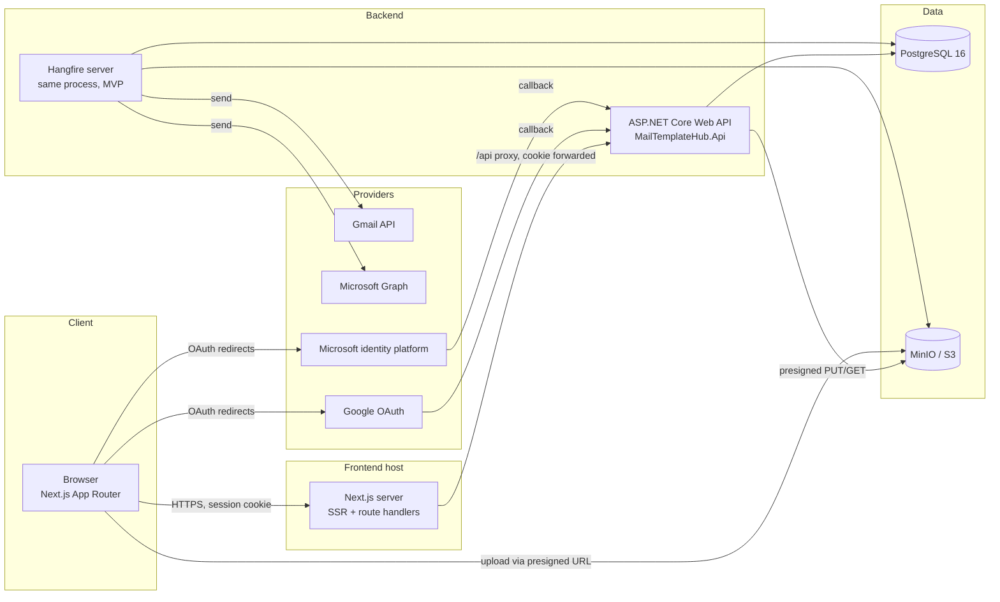
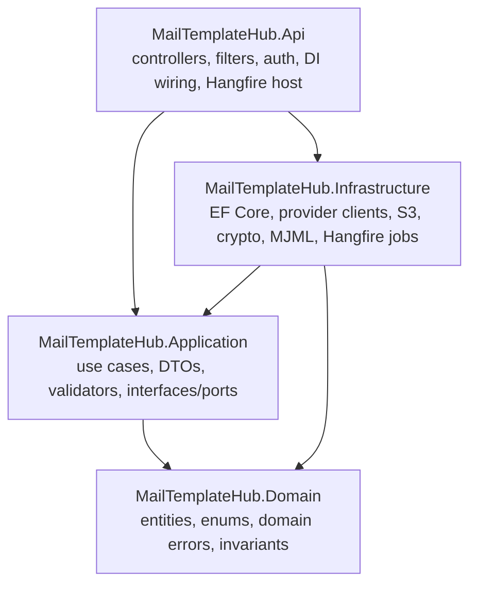

# 03 — System Architecture

## 1. Topology



Key decisions:

- **Modular monolith.** One API process hosts controllers + Hangfire server in MVP.
  Hangfire can be split into a separate worker deployment later with zero code change
  (same DLLs, different hosting flag `Jobs:RunInProcess=false`).
- **Next.js proxies API calls** through a same-origin rewrite (`/api/* → backend`).
  Browser and API share one origin ⇒ SameSite=Lax cookies work, no CORS surface, tokens
  never touch the browser. OAuth callbacks land **directly on the API** (registered
  redirect URIs), which then 302s back to the frontend.
- **Uploads bypass the API body pipeline**: API issues presigned PUT URLs, browser uploads
  straight to MinIO/S3, then confirms. API never buffers multi-MB files (FilePond server
  adapter pointed at our presign endpoints).
- **All sends are asynchronous.** The API request only validates + enqueues; Hangfire
  workers render and call providers. This isolates provider latency/throttling from HTTP
  threads and gives one retry model.

## 2. Backend layering (Clean Architecture — existing projects)



Dependency rules (enforced by project references, checked in CI with an arch test):

- `Domain` references nothing.
- `Application` references only `Domain`. It defines **ports** (interfaces) that
  `Infrastructure` implements: `IEmailProviderClient`, `ITokenRefreshService`,
  `ITemplateRenderer`, `IObjectStorage`, `ITokenCipher`, `IAppDbContext` (or repository
  interfaces), `IClock`, `IBackgroundJobScheduler`.
- `Api` contains no business logic: controllers map DTO ⇄ use case, nothing else.
- `Api` references `Infrastructure` **only** in `Program.cs` composition root.

### Request flow (example: create send job)

```
POST /api/v1/sends
  → SendsController (thin: model bind, call handler)
  → CreateSendJobHandler (Application)
      - FluentValidation: CreateSendJobRequestValidator
      - authorize ownership: account, template version, assets all belong to current user
      - compute size budget, expand recipients, persist EmailSendJob(Queued) + recipients
      - IBackgroundJobScheduler.EnqueueSend(jobId)      // Hangfire behind a port
  → 202 Accepted { sendJobId, status: "queued" }
```

## 3. Provider abstraction (Deliverable 13)

No provider-specific type appears outside `Infrastructure/Providers`. Controllers and
handlers speak only these Application-layer contracts:

```csharp
// Application/Abstractions/Email/IEmailProviderClient.cs
public interface IEmailProviderClient
{
    EmailProvider Provider { get; }              // Gmail | Outlook

    /// Sends a fully built MIME message. Implementations translate provider errors
    /// into ProviderSendException with a typed ProviderErrorKind.
    Task<ProviderSendResult> SendAsync(
        ConnectedAccountContext account,          // decrypted, refreshed token + metadata
        OutgoingEmail email,                      // provider-agnostic (see below)
        CancellationToken ct);

    /// Lightweight authenticated call ("who am I") used by connection test.
    Task<ProviderProfile> GetProfileAsync(ConnectedAccountContext account, CancellationToken ct);

    /// Best-effort token revocation on disconnect.
    Task RevokeAsync(ConnectedAccountContext account, CancellationToken ct);
}

public sealed record OutgoingEmail(
    MailboxAddress From,
    IReadOnlyList<MailboxAddress> To,
    string Subject,
    string HtmlBody,
    string TextBody,
    IReadOnlyList<CidAttachment> InlineAssets,    // content bytes/stream + contentId + mime
    IReadOnlyList<FileAttachment> Attachments,
    IReadOnlyDictionary<string, string> Headers); // e.g. X-MailTemplateHub-Job

public sealed record ProviderSendResult(string? ProviderMessageId, string? ThreadId, string RawStatus);

public enum ProviderErrorKind
{
    Transient,            // 429/5xx/network → retry with backoff (honor RetryAfter)
    AuthExpired,          // access token rejected → refresh once, then retry
    AuthRevoked,          // invalid_grant → mark account NeedsReconnect, fail permanent
    InsufficientScope,    // missing gmail.send / Mail.Send → NeedsReconnect(scope)
    MessageTooLarge,      // permanent, actionable by user
    RecipientRejected,    // permanent for that recipient
    QuotaExceeded,        // daily cap → retry after provider-indicated delay or park
    PermanentOther
}
```

Supporting ports:

```csharp
public interface ITokenRefreshService
{
    /// Returns a valid access token for the account, refreshing (with per-account
    /// distributed lock) if expiring within the skew window. Throws
    /// TokenRefreshException(AuthRevoked) on invalid_grant and flips account state.
    Task<ConnectedAccountContext> GetValidContextAsync(Guid connectedAccountId, CancellationToken ct);
}

public interface IEmailMessageBuilder   // MimeKit lives behind this
{
    BuiltMimeMessage Build(OutgoingEmail email); // MimeMessage + computed size
}

public interface ITemplateRenderer      // full pipeline, see 08-rendering.md
{
    Task<RenderedEmail> RenderAsync(RenderRequest request, CancellationToken ct);
}

public interface IAssetResolver
{
    /// Rewrites asset references in HTML: hosted → public URL, inline → cid: URI,
    /// and returns the CID attachment list. Never fetches foreign URLs (SSRF guard).
    Task<AssetResolution> ResolveAsync(string html, TemplateAssetMap assets, CancellationToken ct);
}

public interface IEmailSendService      // orchestrates one recipient send (called by job)
{
    Task ProcessRecipientAsync(Guid sendJobId, Guid recipientId, CancellationToken ct);
}
```

Resolution: `IEmailProviderClientFactory.For(EmailProvider provider)` returns the right
client (keyed DI registration). `GmailEmailProviderClient` and
`OutlookEmailProviderClient` each own their SDK, error mapping table, and attachment
strategy (07-providers.md).

## 4. Cross-cutting concerns

| Concern | Design |
|---------|--------|
| Validation | FluentValidation validators auto-registered; executed in a MediatR-style pipeline step (or endpoint filter) before handlers; 422 with field map |
| Exceptions | Single `ExceptionHandlingMiddleware` → RFC 7807 `ProblemDetails`; domain errors map to 4xx, everything else 500 with correlation id, never stack traces |
| Logging | Serilog request logging + `ILogger<T>` structured events; enrichers: `UserId`, `TraceId`, `SendJobId` scope in workers; provider tokens/headers scrubbed by policy |
| Telemetry | OpenTelemetry: ASP.NET Core + HttpClient + Npgsql instrumentation, Hangfire job spans via custom activity source `MailTemplateHub.Jobs`; OTLP exporter, console in dev |
| Time | `IClock` abstraction; DB stores `timestamptz` UTC only |
| Cancellation | Every async path takes `CancellationToken` from `HttpContext.RequestAborted` or the Hangfire shutdown token |
| Config | Options pattern (`GoogleOAuthOptions`, `MicrosoftOAuthOptions`, `StorageOptions`, `TokenCryptoOptions`, `SendLimitsOptions`) validated on startup (`ValidateOnStart`) |
| Idempotency | Write endpoints that clients may retry (`POST /sends`, upload complete) accept `Idempotency-Key` header stored 24 h |

## 5. Environments

| Env | DB | Storage | OAuth apps | Notes |
|-----|----|---------|-----------|-------|
| Local | Docker Postgres | Docker MinIO | Dev Google/Azure app registrations, `http://localhost:5001` callbacks | `docker-compose.yml` in repo root |
| Staging | Managed PG | MinIO or S3 bucket `mth-staging` | Staging registrations | Google app still "testing" until verified |
| Production | Managed PG (PITR backups) | S3 + CloudFront/CDN for public assets | Verified apps | KMS-backed key for token crypto |

## 6. Folder structure (Deliverable M)

### Backend (extends the existing solution)

```
MailTemplateHub.slnx
├── MailTemplateHub.Domain/
│   ├── Entities/            User.cs, ConnectedEmailAccount.cs, OAuthToken.cs,
│   │                        EmailTemplate.cs, EmailTemplateVersion.cs, TemplateAsset.cs,
│   │                        Asset.cs, Contact.cs, ContactGroup.cs, EmailDraft.cs,
│   │                        EmailSendJob.cs, EmailSendRecipient.cs, EmailSendAttachment.cs,
│   │                        EmailProviderEvent.cs, AuditLog.cs
│   ├── Enums/               EmailProvider.cs, AccountState.cs, SendJobStatus.cs,
│   │                        RecipientStatus.cs, AssetKind.cs, AuditAction.cs, ...
│   └── Errors/              DomainException.cs, ErrorCodes.cs
├── MailTemplateHub.Application/
│   ├── Abstractions/        IAppDbContext.cs, IObjectStorage.cs, ITokenCipher.cs, IClock.cs,
│   │   ├── Email/           IEmailProviderClient.cs, ITokenRefreshService.cs,
│   │   │                    IEmailMessageBuilder.cs, IEmailSendService.cs
│   │   ├── Rendering/       ITemplateRenderer.cs, IAssetResolver.cs, IHtmlSanitizer.cs,
│   │   │                    IMjmlCompiler.cs, IPlainTextGenerator.cs
│   │   └── Jobs/            IBackgroundJobScheduler.cs
│   ├── Features/            (vertical slices: one folder per use case)
│   │   ├── Auth/            Register/, Login/, ResetPassword/, Sessions/
│   │   ├── Accounts/        ConnectProvider/, OAuthCallback/, Disconnect/, SetDefault/, List/
│   │   ├── Templates/       Create/, Update/, Duplicate/, Archive/, Delete/, List/, Get/
│   │   ├── TemplateVersions/ Save/, List/, Restore/
│   │   ├── Assets/          RequestUpload/, CompleteUpload/, List/, Delete/
│   │   ├── Rendering/       Preview/, Validate/
│   │   ├── Sends/           Create/, Cancel/, Retry/, Reschedule/, List/, Get/, TestSend/
│   │   ├── Contacts/        ...
│   │   └── Audit/           List/
│   └── Common/              Result.cs, PagedResult.cs, ValidationBehavior.cs, Mapping/
├── MailTemplateHub.Infrastructure/
│   ├── Persistence/         AppDbContext.cs, Configurations/ (one IEntityTypeConfiguration per entity),
│   │                        Migrations/, Interceptors/ (audit stamps, soft delete filter)
│   ├── Providers/
│   │   ├── Google/          GmailEmailProviderClient.cs, GoogleOAuthService.cs, GoogleErrorMap.cs
│   │   └── Microsoft/       OutlookEmailProviderClient.cs, MicrosoftOAuthService.cs, GraphErrorMap.cs
│   ├── Email/               MimeKitEmailMessageBuilder.cs
│   ├── Rendering/           MjmlNetCompiler.cs, GanssHtmlSanitizer.cs, PreMailerCssInliner.cs,
│   │                        HandlebarsVariableRenderer.cs, HtmlToTextGenerator.cs, TemplateRenderer.cs
│   ├── Storage/             S3ObjectStorage.cs, PresignedUrlService.cs
│   ├── Security/            AesGcmTokenCipher.cs, OAuthStateService.cs, PasswordHasher.cs
│   ├── Jobs/                SendEmailJob.cs, PromoteScheduledSendsJob.cs, RefreshTokensJob.cs,
│   │                        CleanupAssetsJob.cs, HangfireJobScheduler.cs
│   └── DependencyInjection.cs
├── MailTemplateHub.Api/
│   ├── Controllers/         AuthController, MeController, OAuthController, EmailAccountsController,
│   │                        TemplatesController, TemplateVersionsController, AssetsController,
│   │                        RenderController, SendsController, ContactsController, AuditLogsController
│   ├── Middleware/          ExceptionHandlingMiddleware.cs, CsrfMiddleware.cs
│   ├── Auth/                SessionCookieAuthHandler.cs (or Identity wiring), CurrentUser.cs
│   ├── Contracts/           request/response records if not shared from Application DTOs
│   └── Program.cs
└── tests/
    ├── MailTemplateHub.UnitTests/
    ├── MailTemplateHub.IntegrationTests/     (Testcontainers: Postgres + MinIO + WireMock)
    └── MailTemplateHub.ArchitectureTests/    (NetArchTest dependency rules)
```

### Frontend

```
frontend/
├── next.config.ts            (rewrites /api/* → API_URL)
├── src/
│   ├── app/
│   │   ├── (auth)/login/page.tsx, register/page.tsx, reset-password/page.tsx
│   │   ├── (app)/                    ← authenticated layout: sidebar, session guard
│   │   │   ├── dashboard/page.tsx
│   │   │   ├── accounts/page.tsx     + connected/callback result toasts
│   │   │   ├── templates/page.tsx
│   │   │   ├── templates/[id]/edit/page.tsx        (editor shell: visual/source/preview tabs)
│   │   │   ├── assets/page.tsx
│   │   │   ├── compose/page.tsx
│   │   │   ├── sends/page.tsx        (history)  · sends/scheduled/page.tsx · sends/[id]/page.tsx
│   │   │   ├── contacts/page.tsx
│   │   │   ├── settings/page.tsx
│   │   │   └── audit/page.tsx
│   │   └── layout.tsx, globals.css
│   ├── components/
│   │   ├── ui/               shadcn/ui primitives
│   │   ├── editor/           GrapesEditor.tsx (client-only, dynamic import), MjmlSourceEditor.tsx,
│   │   │                     PreviewPane.tsx, VariablePanel.tsx, TestSendDialog.tsx
│   │   ├── assets/           AssetLibrary.tsx, AssetPickerDialog.tsx, UploadDropzone.tsx (FilePond)
│   │   ├── sends/            SendStatusBadge.tsx, RecipientTable.tsx, SendWizard/
│   │   └── accounts/         AccountCard.tsx, ConnectButtons.tsx
│   ├── lib/
│   │   ├── api/              client.ts (fetch wrapper: CSRF header, 401 redirect),
│   │   │                     endpoints per resource (templates.ts, sends.ts, ...)
│   │   ├── schemas/          zod schemas mirrored from API DTOs (single source, generated or hand-kept)
│   │   ├── query/            queryClient.ts, queryKeys.ts
│   │   └── hooks/            useTemplates.ts, useSendJob.ts (polling), useAssets.ts, useSession.ts
│   └── types/
└── e2e/                      Playwright specs
```
