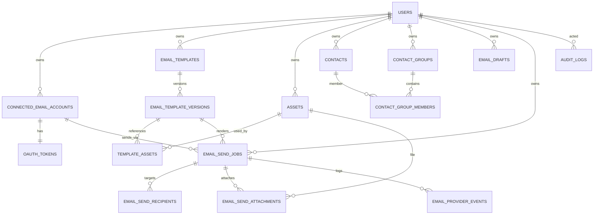

# 05 — Database Schema (PostgreSQL 16 / EF Core 8)

## Conventions

- **PKs:** `uuid`, generated as **UUIDv7** app-side (`Guid.CreateVersion7()`) — time-ordered, index-friendly.
- **Timestamps:** `timestamptz`, UTC only. `CreatedAt` on all tables; `UpdatedAt` on mutable tables (set by an EF `SaveChanges` interceptor); `DeletedAt` where soft delete applies.
- **Soft delete:** `DeletedAt IS NULL` global query filter on: Users, ConnectedEmailAccounts, EmailTemplates, Assets, Contacts, ContactGroups, EmailDrafts. Send/audit/version tables are **never** deleted (history).
- **Ownership:** every user-owned table has `UserId uuid NOT NULL → Users(Id)` and a leading index on it. Adding orgs later = add nullable `OrganizationId` beside it.
- **Concurrency:** EF maps PostgreSQL `xmin` as the concurrency token on mutable aggregates (templates, drafts, send jobs).
- **Enums:** stored as `text` with check constraints (readable, migration-friendly), mapped to C# enums via EF value converters.
- **Naming:** snake_case in DB via `EFCore.NamingConventions` (`UseSnakeCaseNamingConvention`).

## ER overview

## Tables

### users

| Column | Type | Notes |
|--------|------|-------|
| id | uuid PK | |
| email | citext NOT NULL | `citext` extension; UNIQUE where deleted_at IS NULL (partial) |
| email_verified_at | timestamptz NULL | |
| password_hash | text NOT NULL | argon2id encoded string |
| display_name | text NOT NULL | ≤ 100 |
| default_account_id | uuid NULL → connected_email_accounts(id), ON DELETE SET NULL | convenience pointer; source of truth is `is_default` below |
| created_at / updated_at / deleted_at | timestamptz | |

Indexes: `UX users_email_active ON users(email) WHERE deleted_at IS NULL`.

### user_sessions

| Column | Type | Notes |
|--------|------|-------|
| id | uuid PK | |
| user_id | uuid NOT NULL → users | ON DELETE CASCADE |
| token_hash | bytea NOT NULL UNIQUE | SHA-256 of session id; raw id only in cookie |
| ip / user_agent | inet / text | |
| created_at / last_seen_at / expires_at | timestamptz NOT NULL | |

Index: `IX user_sessions_user (user_id)`; cleanup job deletes expired.

### password_reset_tokens
`id uuid PK · user_id → users CASCADE · token_hash bytea UNIQUE · expires_at · used_at NULL · created_at`

### oauth_states (transient, callback CSRF)
`id uuid PK · user_id → users CASCADE · provider text · pkce_verifier text · return_to text · created_at · expires_at` — row deleted on use; sweep deletes expired.

### connected_email_accounts

| Column | Type | Notes |
|--------|------|-------|
| id | uuid PK | |
| user_id | uuid NOT NULL → users | |
| provider | text NOT NULL | `gmail` \| `outlook` (CHECK) |
| provider_account_id | text NOT NULL | Google `sub` / MS `oid`/`sub` |
| email_address | citext NOT NULL | |
| display_name | text NULL | |
| tenant_id | text NULL | MS only (`tid`); NULL for MSA/Gmail |
| granted_scopes | text[] NOT NULL | |
| state | text NOT NULL | `active` \| `needs_reconnect` \| `revoked` (CHECK) |
| state_reason | text NULL | `insufficient_scope`, `invalid_grant`, `user_disconnect`… |
| is_default | boolean NOT NULL DEFAULT false | |
| connected_at / last_used_at | timestamptz | |
| created_at / updated_at / deleted_at | timestamptz | |

Constraints & indexes:
- `UX cea_provider_account ON (user_id, provider, provider_account_id) WHERE deleted_at IS NULL` — reconnect upserts.
- `UX cea_one_default ON (user_id) WHERE is_default AND deleted_at IS NULL` — at most one default.
- `IX cea_user (user_id)`.

### oauth_tokens (1:1 with account; separated so the hot account row never carries ciphertext)

| Column | Type | Notes |
|--------|------|-------|
| connected_email_account_id | uuid PK → connected_email_accounts ON DELETE CASCADE | PK = FK (1:1) |
| access_token_ciphertext / access_token_nonce | bytea NOT NULL | AES-256-GCM |
| refresh_token_ciphertext / refresh_token_nonce | bytea NULL | NULL if provider withheld |
| wrapped_dek | bytea NOT NULL | DEK wrapped by KEK |
| kek_version | int NOT NULL | rotation support |
| access_token_expires_at | timestamptz NOT NULL | |
| refresh_token_expires_at | timestamptz NULL | MS sliding window, best-effort |
| last_refreshed_at | timestamptz NULL | |
| refresh_failure_count | int NOT NULL DEFAULT 0 | |
| created_at / updated_at | timestamptz | |

Index: `IX oauth_tokens_expiry (access_token_expires_at)` for the proactive refresh sweep.

### email_templates

| Column | Type | Notes |
|--------|------|-------|
| id | uuid PK · user_id → users | |
| name | text NOT NULL | ≤ 200; `UX templates_user_name ON (user_id, lower(name)) WHERE deleted_at IS NULL` |
| description | text NULL | |
| current_version_id | uuid NULL → email_template_versions | set after first version insert (deferred FK pair) |
| is_archived | boolean NOT NULL DEFAULT false | |
| created_at / updated_at / deleted_at | timestamptz | |

Index: `IX templates_user_archived (user_id, is_archived) WHERE deleted_at IS NULL`.

### email_template_versions (immutable after insert)

| Column | Type | Notes |
|--------|------|-------|
| id | uuid PK | |
| template_id | uuid NOT NULL → email_templates ON DELETE RESTRICT | RESTRICT: history must survive; template delete is soft |
| version_number | int NOT NULL | `UX tv_number ON (template_id, version_number)` |
| subject | text NOT NULL | ≤ 500, may contain `{{vars}}` |
| preheader | text NULL | ≤ 500 |
| mjml_source | text NULL | source of truth when present |
| grapes_project | jsonb NULL | GrapesJS project JSON |
| html_body | text NOT NULL | compiled + sanitized |
| text_body | text NULL | generated or user-supplied |
| variables_schema | jsonb NOT NULL DEFAULT '[]' | `[{name, type: text\|url\|html, required, default, sample}]` |
| editor_kind | text NOT NULL | `visual` \| `mjml` \| `html` (CHECK) |
| created_by_user_id | uuid NOT NULL → users | |
| created_at | timestamptz | no updated_at — immutable |

Index: `IX tv_template (template_id, version_number DESC)`.

### template_assets (join: which assets a version uses, and how)

| Column | Type | Notes |
|--------|------|-------|
| id | uuid PK | |
| template_version_id | uuid NOT NULL → email_template_versions ON DELETE CASCADE | |
| asset_id | uuid NOT NULL → assets ON DELETE RESTRICT | RESTRICT drives "asset in use" check |
| usage | text NOT NULL | `inline_cid` \| `hosted_image` \| `attachment` (CHECK) |
| content_id | text NULL | the `cid:` value; NOT NULL when usage=inline_cid |
| created_at | timestamptz | |

`UX ta_unique ON (template_version_id, asset_id, usage)` · `IX ta_asset (asset_id)`.

### assets

| Column | Type | Notes |
|--------|------|-------|
| id | uuid PK · user_id → users | |
| kind | text NOT NULL | `image` \| `gif` \| `document` \| `archive` \| `other` (CHECK) |
| original_filename | text NOT NULL | display only; storage key is server-generated |
| storage_key | text NOT NULL UNIQUE | `private/assets/{userId}/{assetId}/{slug}` |
| public_url | text NULL | set only when promoted to `public/` prefix |
| access | text NOT NULL DEFAULT 'private' | `private` \| `public` (CHECK) |
| mime_type | text NOT NULL | verified server-side |
| size_bytes | bigint NOT NULL | CHECK > 0 |
| checksum_sha256 | bytea NOT NULL | `UX assets_user_checksum ON (user_id, checksum_sha256) WHERE deleted_at IS NULL` (dedupe) |
| width / height | int NULL | images only |
| upload_state | text NOT NULL | `pending` \| `ready` \| `rejected` (CHECK) — presigned flow |
| created_at / updated_at / deleted_at | timestamptz | |

Indexes: `IX assets_user_kind (user_id, kind) WHERE deleted_at IS NULL`; `IX assets_pending (upload_state, created_at) WHERE upload_state = 'pending'` (cleanup sweep).

### contacts

`id uuid PK · user_id → users · email citext NOT NULL · first_name/last_name/company text NULL · custom_fields jsonb DEFAULT '{}' · created_at/updated_at/deleted_at`
`UX contacts_user_email ON (user_id, email) WHERE deleted_at IS NULL`.

### contact_groups
`id uuid PK · user_id → users · name text NOT NULL · description text NULL · created_at/updated_at/deleted_at`
`UX cg_user_name ON (user_id, lower(name)) WHERE deleted_at IS NULL`.

### contact_group_members
`contact_group_id → contact_groups CASCADE · contact_id → contacts CASCADE · created_at` — composite PK `(contact_group_id, contact_id)`; `IX cgm_contact (contact_id)`.

### email_drafts (compose-in-progress; distinct from send jobs)

| Column | Type | Notes |
|--------|------|-------|
| id | uuid PK · user_id → users | |
| connected_email_account_id | uuid NULL → connected_email_accounts SET NULL | |
| template_version_id | uuid NULL → email_template_versions SET NULL | |
| subject_override | text NULL · variable_values jsonb DEFAULT '{}' · recipients jsonb DEFAULT '[]' | recipients: `[{email,name,contactId?}]` |
| attachment_asset_ids | uuid[] DEFAULT '{}' | validated on load |
| created_at / updated_at / deleted_at | timestamptz | |

`IX drafts_user (user_id, updated_at DESC) WHERE deleted_at IS NULL`.

### email_send_jobs

| Column | Type | Notes |
|--------|------|-------|
| id | uuid PK · user_id → users | |
| connected_email_account_id | uuid NOT NULL → connected_email_accounts RESTRICT | |
| template_version_id | uuid NOT NULL → email_template_versions RESTRICT | pinned at creation |
| status | text NOT NULL | `scheduled` \| `queued` \| `sending` \| `sent` \| `partially_failed` \| `failed` \| `retrying` \| `cancelled` (CHECK) |
| is_test | boolean NOT NULL DEFAULT false | |
| subject_snapshot | text NOT NULL | rendered subject (shared variables) |
| variable_values | jsonb NOT NULL DEFAULT '{}' | job-level values (per-recipient overrides live on recipient) |
| scheduled_at | timestamptz NULL | NOT NULL iff created as scheduled |
| queued_at / started_at / completed_at | timestamptz NULL | |
| attempt_count | int NOT NULL DEFAULT 0 · next_attempt_at timestamptz NULL | job-level retry bookkeeping |
| failure_code / failure_message | text NULL | typed `ProviderErrorKind` + safe message |
| rendered_snapshot_key | text NULL | object storage key (html+text zip) |
| idempotency_key | text NULL | `UX sj_idem ON (user_id, idempotency_key)` |
| total_size_bytes | bigint NULL | computed at build time |
| created_at / updated_at | timestamptz | xmin concurrency token |

Indexes: `IX sj_user_status (user_id, status, created_at DESC)` · `IX sj_due ON (scheduled_at) WHERE status = 'scheduled'` (promoter sweep) · `IX sj_account (connected_email_account_id)`.

### email_send_recipients

| Column | Type | Notes |
|--------|------|-------|
| id | uuid PK | |
| send_job_id | uuid NOT NULL → email_send_jobs CASCADE | |
| contact_id | uuid NULL → contacts SET NULL | |
| email_address | citext NOT NULL · display_name text NULL | snapshot, survives contact edits |
| variable_overrides | jsonb NOT NULL DEFAULT '{}' | per-recipient personalization |
| status | text NOT NULL | `pending` \| `sending` \| `sent` \| `failed` \| `cancelled` (CHECK) |
| attempt_count int DEFAULT 0 · last_attempt_at timestamptz NULL | | |
| provider_message_id / provider_thread_id | text NULL | from Gmail/Graph response |
| failure_code / failure_message | text NULL | |
| created_at / updated_at | timestamptz | |

Indexes: `IX sr_job (send_job_id, status)` · `IX sr_email (email_address)` (history search) · `UX sr_job_email ON (send_job_id, email_address)` (no dup recipients per job).

### email_send_attachments

| Column | Type | Notes |
|--------|------|-------|
| id | uuid PK | |
| send_job_id | uuid NOT NULL → email_send_jobs CASCADE | |
| asset_id | uuid NOT NULL → assets RESTRICT | RESTRICT feeds "in use" check |
| disposition | text NOT NULL | `attachment` \| `inline` (CHECK) |
| content_id | text NULL | for inline |
| filename_override | text NULL | |
| created_at | timestamptz | |

`UX sa_unique ON (send_job_id, asset_id, disposition)`.

### email_provider_events (append-only provider interaction log)

| Column | Type | Notes |
|--------|------|-------|
| id | uuid PK | |
| send_job_id | uuid NULL → email_send_jobs CASCADE · recipient_id uuid NULL → email_send_recipients CASCADE | |
| connected_email_account_id | uuid NULL → connected_email_accounts SET NULL | token events without a job |
| provider | text NOT NULL · event_type text NOT NULL | `send_attempt` \| `send_success` \| `send_failure` \| `throttled` \| `token_refresh` \| `token_refresh_failed` |
| http_status int NULL · provider_error_code text NULL | e.g. `rateLimitExceeded`, `ErrorMessageSubmissionBlocked` |
| retry_after_seconds int NULL · detail jsonb NULL | sanitized — never tokens or full bodies |
| created_at | timestamptz | |

`IX pe_job (send_job_id, created_at)` · `IX pe_account (connected_email_account_id, created_at)`.

### audit_logs (append-only; app role has INSERT/SELECT only)

| Column | Type | Notes |
|--------|------|-------|
| id | uuid PK · user_id uuid NULL → users SET NULL | NULL for system actions |
| action | text NOT NULL | codes from 04-security.md §7 |
| entity_type text NULL · entity_id uuid NULL | |
| ip inet NULL · user_agent text NULL | |
| metadata | jsonb NOT NULL DEFAULT '{}' | counts/names only, no secrets |
| created_at | timestamptz NOT NULL | |

`IX audit_user_time (user_id, created_at DESC)` · `IX audit_action (action, created_at DESC)`. Consider monthly partitioning post-MVP.

### idempotency_keys
`key text · user_id uuid · request_hash bytea · response_status int · response_body jsonb · created_at` — PK `(user_id, key)`; TTL 24 h via sweep.

## EF Core implementation notes

- `AppDbContext` exposes `DbSet<>` per entity; all mapping in `IEntityTypeConfiguration<T>` classes under `Infrastructure/Persistence/Configurations`.
- Global query filters: soft delete + ownership (`UserId == _currentUser.Id`) on owned entities; jobs/system paths use `IgnoreQueryFilters()` deliberately and pass user context explicitly.
- `SaveChangesInterceptor` stamps `CreatedAt/UpdatedAt` from `IClock`.
- `citext`, `uuid-ossp`-free (app-generated UUIDv7); enable `citext` extension in the first migration.
- Migrations project = Infrastructure; CI runs `dotnet ef migrations script --idempotent` and applies via startup gate in dev, pipeline step in prod.
- Queue pattern: the send worker claims recipients with `SELECT ... FOR UPDATE SKIP LOCKED` (raw SQL through EF) to allow multiple workers without double-send.
