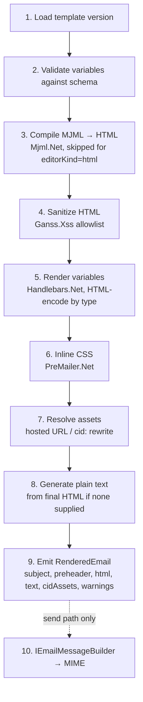

# 08 — Template Rendering Specification

## 1. Separation of concerns

| Concept | Stored where | Mutability |
|---|---|---|
| **Template source** | `email_template_versions` (`mjml_source`, `grapes_project`, `html_body` pre-render) | Immutable per version |
| **Template version** | Same row: subject, preheader, variables schema, asset map | Immutable |
| **Rendered email** | In-memory `RenderedEmail` during preview/send; persisted snapshot (`snapshots/{jobId}.json.gz` in object storage) only for real sends | Ephemeral / audit artifact |
| **Sent email record** | `email_send_jobs` + `email_send_recipients` (+ provider ids) | Append/update via job lifecycle |

The snapshot stores rendered subject + HTML + text **with job-level variables applied but
per-recipient overrides tokenized** (`{{firstName}}` left visible) — audit value without
persisting every recipient's personalized body (data-minimization requirement §5 of the brief).

## 2. Pipeline (`ITemplateRenderer.RenderAsync`)

Step contracts:

1. **Load** — version + `template_assets` map; ownership already verified by caller.
2. **Validate variables** — merge `defaults ∪ jobValues ∪ recipientOverrides`; `strict`
   mode fails on missing required vars (typed list); values type-checked:
   `text` (any string, will be encoded), `url` (absolute http/https), `html`
   (raw-allowed, still sanitized in step 4½ below).
3. **MJML compile** — Mjml.Net with `beautify=false, minify=false`; compile errors carry
   line/column. ⚠️ Port-fidelity risk: golden-file tests vs. reference `mjml` CLI output
   for the 12 canonical templates; if a blocking gap appears, swap `IMjmlCompiler` to the
   documented Node sidecar (`mjml-http-server` container) — interface already isolates it.
4. **Sanitize** — allowlist: structural/table tags, `img`, `a`, inline styles, `<style>`
   in head (kept until step 6 inlines it), MSO conditional comments preserved via
   pre/post-processing (they're how Outlook buttons work). Stripped: scripts, event
   handlers, iframes/objects/forms, `javascript:`/`data:` URIs (except `data:image/*`
   which is converted to a CID asset or rejected by size).
5. **Variables** — Handlebars.Net (`{{var}}`, and `{{#if}}/{{#each}}` powering dynamic
   sections). HTML-encoding by default; `{{{triple}}}` disallowed — raw insertion only
   via schema type `html`. Unknown tokens in `strict` = error; in `sample` = highlighted
   `<mark>` in preview.
6. **Inline CSS** — PreMailer.Net moves `<style>` rules onto elements (Gmail clips
   `<style>` support in some contexts); keeps media queries in a retained `<style>` block
   for clients that support them; strips unsupported properties list (position, float
   warnings).
7. **Assets** — `IAssetResolver` rewrites editor-inserted markers
   (`mth-asset://{assetId}`) to public URL (hosted) or `cid:` URI (inline), returning the
   CID attachment manifest (streams from storage). Foreign `http(s)` `` values
   are left untouched but flagged with warning `remote_image` — never fetched server-side (SSRF).
8. **Plain text** — AngleSharp-based walker: headings → UPPERCASE lines, `<a>` →
   `text (url)`, `
` → `----`, tables → tab-separated, images → `[alt]`; ≤ 78-char soft wrap.
   Skipped when the version has explicit `text_body` (variables still rendered into it).
9. **Warnings** (never block, shown in preview/validate): HTML > 102 KB (Gmail clips),
   images missing `alt`, total CID weight > 5 MB, width > 640 px, `remote_image`,
   GIF-first-frame notice, background-image (Outlook desktop ignores).

Determinism: same version + same variables ⇒ byte-identical output (no timestamps
injected), which makes snapshot diffing and golden tests possible.

## 3. Caching & performance

- Steps 1–4 + 6 depend only on the version ⇒ their output ("prepared HTML") is cached
  (`IMemoryCache`, key = versionId, TTL 15 min) — per-recipient work is only variable
  substitution + asset manifest reuse.
- Preview endpoint budget: p95 < 400 ms warm. MJML compile of a large template ~50–150 ms.

## 4. Test-send parity

Test sends run the **identical** pipeline and MIME builder as real sends (only recipient
list and `[TEST]` subject prefix differ) — parity is a hard requirement so "test looked
fine" is meaningful.
